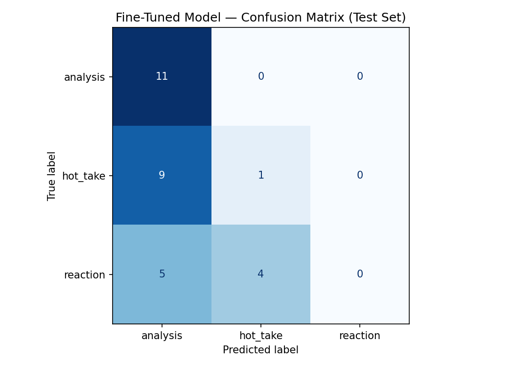

# NBA Discourse Classification (TakeMeter)

Fine-tuned NLP classifier that evaluates discourse quality in the r/nba community by categorizing comments as Analysis, Hot Take, or Reaction. The project compares a fine-tuned DistilBERT classifier against a zero-shot Llama 3.3 baseline to evaluate whether task-specific fine-tuning improves performance.

---

# Community Choice and Reasoning

I selected r/nba because it contains a large volume of public discussions ranging from detailed basketball analysis to emotional reactions and controversial opinions. NBA discussions frequently include statistical arguments, predictions, rankings, trade evaluations, emotional celebrations, and instant reactions, making it an excellent environment for a discourse classification task.

The distinction between Analysis, Hot Take, and Reaction is meaningful within the community because users regularly debate whether a comment is evidence-based or simply an emotional opinion.

---

# Label Taxonomy

## Analysis

A comment that uses specific facts, evidence, statistics, historical comparisons, or logical reasoning to support, explain, question, or evaluate a basketball-related claim.

### Examples

> "Furthest Draft pick is Jack Sikma, the 1977 Supersonics 1st round pick, however, he wasn't traded until July 1, 1986. The Cavaliers have them beat by a few weeks with a June 17, 1986 trade of a future 2nd for Mark Price."

> "Definitely not the most a team has gotten from trading Paul George but Haliburton, Siakam, Huff, Zubac, Kobe Brown, Nembhard, Sheppard, and Furphy is still a pretty good return all things considered."

---

## Hot Take

A bold opinion, prediction, ranking, or claim stated confidently without meaningful supporting evidence.

### Examples

> "Man they really got hosed in the Luka trade."

> "Peak offseason content and we're not even two weeks in. Won't be topped."

---

## Reaction

An emotional, celebratory, sarcastic, angry, shocked, or disappointed response with little or no reasoning.

### Examples

> "WE'RE SOOO BACKKK"

> "Jesus this is so incredibly pathetic."

---

# Data Collection

## Data Source

Public comments collected from r/nba.

## Dataset Size

200 labeled comments.

## Label Distribution

| Label | Count |
|---------|---------:|
| Analysis | 70 |
| Hot Take | 65 |
| Reaction | 65 |

The dataset was intentionally balanced to avoid majority-class bias and to give the model sufficient exposure to each discourse category.

## Labeling Process

Comments were manually reviewed and assigned a label based on the definitions above. The goal was to identify the primary discourse intent of each comment rather than its topic.

Comments that were purely jokes, suggestions, or meta-discussion and did not fit the taxonomy were excluded from the dataset.

---

# Difficult-to-Label Examples

## Example 1

> "LeBron is overrated. His playoff record against top seeds proves it."

Possible labels:
- Analysis
- Hot Take

Decision:
Classified as Hot Take because the statistic is used primarily to support a bold opinion rather than provide a structured argument.

---

## Example 2

> "The Spurs have 7 players who have never played anywhere but their team which is one of the highest in the league."

Possible labels:
- Analysis
- Hot Take

Decision:
Classified as Analysis because it presents a factual observation that supports a conclusion about roster continuity.

---

## Example 3

> "Durant is delusional."

Possible labels:
- Hot Take
- Reaction

Decision:
Classified as Reaction because the primary purpose is emotional judgment rather than making a basketball argument.

---

# Fine-Tuning Approach

## Base Model

distilbert-base-uncased

## Training Environment

- Google Colab
- T4 GPU
- Hugging Face Transformers

## Training Configuration

- Epochs: 3
- Learning Rate: 2e-5
- Batch Size: 16

## Hyperparameter Decision

The default learning rate of 2e-5 and 3 epochs were retained because the dataset contains only 200 examples. Increasing the number of epochs could have caused overfitting on such a small dataset.

---

# Zero-Shot Baseline

## Model

Llama 3.3 70B Versatile via Groq

## Prompt

The baseline model was given the label definitions, examples, and decision rules and was instructed to output only one of the following labels:

- analysis
- hot_take
- reaction

The model was evaluated on the same 30-example test set used for the fine-tuned model.

---

# Evaluation Report

## Test Set Size

30 examples

---

## Overall Accuracy

| Model | Accuracy |
|---------|---------:|
| Llama 3.3 Zero-Shot Baseline | 1.00 |
| Fine-Tuned DistilBERT | 0.40 |

Fine-tuning regression: 0.60

---

## Per-Class Metrics

### Fine-Tuned DistilBERT

| Label | Precision | Recall | F1 Score |
|---------|---------:|---------:|---------:|
| Analysis | 0.44 | 1.00 | 0.61 |
| Hot Take | 0.20 | 0.10 | 0.13 |
| Reaction | 0.00 | 0.00 | 0.00 |

### Llama 3.3 Zero-Shot Baseline

| Label | Precision | Recall | F1 Score |
|---------|---------:|---------:|---------:|
| Analysis | 1.00 | 1.00 | 1.00 |
| Hot Take | 1.00 | 1.00 | 1.00 |
| Reaction | 1.00 | 1.00 | 1.00 |

---

## Fine-Tuned Model Confusion Matrix

| True Label | Predicted Analysis | Predicted Hot Take | Predicted Reaction |
|------------|------------------:|-------------------:|------------------:|
| Analysis | 11 | 0 | 0 |
| Hot Take | 9 | 1 | 0 |
| Reaction | 5 | 4 | 0 |

---

# Failure Analysis

The largest failure pattern was over-prediction of the Analysis class.

Every Analysis example in the test set was correctly classified, but the model struggled to distinguish Hot Takes and Reactions. The model never correctly predicted a Reaction example.

This suggests that the model learned surface-level indicators such as factual language, historical references, player names, and comment length rather than the intended distinction between evidence-based reasoning, unsupported opinions, and emotional reactions.

## Failure Example 1

**Comment**

> "That was the most lopsided trade since the Gasol deal and it's not even debatable."

**True Label:** Hot Take

**Predicted Label:** Analysis

**Confidence:** 0.37

### Analysis

The statement contains a historical comparison, which resembles Analysis language. However, it provides no evidence and functions as a strong unsupported opinion.

---

## Failure Example 2

**Comment**

> "ARE YOU KIDDING ME WITH THIS"

**True Label:** Reaction

**Predicted Label:** Analysis

**Confidence:** 0.34

### Analysis

This is a pure emotional reaction with no basketball reasoning. The prediction suggests the model struggled with short comments and defaulted toward Analysis when insufficient information was present.

---

## Failure Example 3

**Comment**

> "That signing instantly makes them the team to beat in the West, no question."

**True Label:** Hot Take

**Predicted Label:** Analysis

**Confidence:** 0.39

### Analysis

The statement makes a bold prediction without supporting evidence. The model appears to confuse confident declarative language with evidence-based reasoning.

---

# Sample Classifications

| Comment | Predicted Label | Confidence |
|----------|----------|----------:|
| "Furthest Draft pick is Jack Sikma..." | Analysis | 0.84 |
| "That signing instantly makes them the team to beat in the West." | Analysis | 0.39 |
| "ARE YOU KIDDING ME WITH THIS" | Analysis | 0.34 |
| "LETS GOOOOO BABY" | Analysis | 0.37 |
| "The Warriors window slammed shut two years ago." | Analysis | 0.35 |

### Correct Prediction Example

The Jack Sikma example is a reasonable Analysis prediction because it contains historical evidence, dates, and factual comparisons that support a basketball-related conclusion.

---

# Reflection: What the Model Learned vs. What I Intended

My goal was for the model to learn the distinction between:

1. Evidence-based basketball reasoning (Analysis)
2. Unsupported opinions (Hot Take)
3. Emotional responses (Reaction)

Instead, the model primarily learned a distinction between analytical-looking comments and everything else. It successfully identified Analysis posts but failed to reliably separate Hot Takes from Reactions.

The zero-shot Llama 3.3 baseline dramatically outperformed the fine-tuned model, achieving perfect performance on the test set. This suggests that the discourse categories were already well represented within the pretrained knowledge of the larger language model and that the 200-example dataset was insufficient for DistilBERT to learn robust decision boundaries.

---

# Spec Reflection

## How the Spec Helped

The project specification emphasized label design and edge-case handling before any model training occurred. This forced careful consideration of category boundaries and improved annotation consistency throughout the dataset creation process.

## How Implementation Diverged

My original expectation was that fine-tuning would improve performance relative to the baseline. Instead, the fine-tuned model performed substantially worse than the zero-shot baseline. This unexpected result became the most important finding of the project and highlighted the limitations of small-scale fine-tuning compared to modern large language models.

---

# AI Usage

## Example 1: Label Stress Testing

ChatGPT was used during the planning phase to generate boundary cases between Analysis, Hot Take, and Reaction labels. Several generated examples exposed ambiguities in the original taxonomy, leading to revised definitions and decision rules before annotation began.

## Example 2: Annotation Assistance

ChatGPT was used to review and validate a subset of labeled examples. All final labels were manually reviewed and approved before inclusion in the dataset.

## Example 3: Failure Analysis

After model evaluation, ChatGPT was used to analyze misclassified examples and identify recurring error patterns. The suggested patterns were manually verified before being included in the evaluation report.